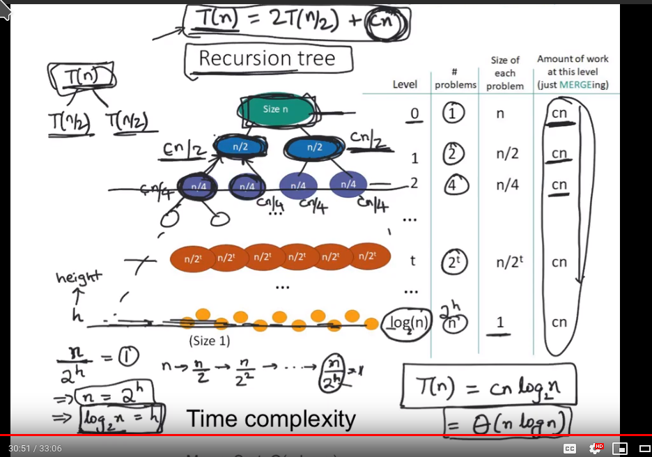
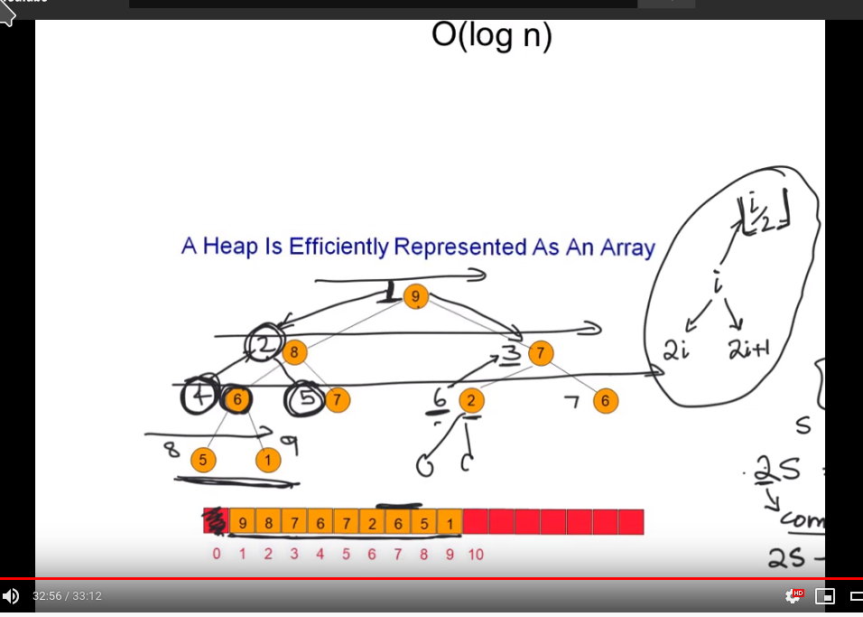

# Sorting notes

###complexity/time
solvable in minutes

θ(1) | θ(log n) | θ(n) | θ(n log n) | θ(n^2) | θ(n^3) | θ(2n)
-----|----------|------|------------|--------|--------|------
any | any| billions| hundreds <br>of millions| tens of<br>thousands| thousands| 30 


### strategies
```
brute force
divide and conquer
decrease and conquer
transform and conquer

faster: merge, quick, heap

almost sorted => insertion sort, radix
stability => merge, insertion
in place => quick/heap
fastest => quick sort

```

### Heap
```
height of tree == 2H nodes
tree height = log(n+1) -1
2^0 + 2^1 +2^3....2^h 

move up/down heap
up = i/2 (parent)
down = i*2 +- 1 (children)

insert, delete, increase, decrease = O(log n)
extract max = 

build heap = O(n)

heapsort = O(n long n)

in-place = yes
stable = no
streaming = yes
```

#selection sort
t(n) = n(n-1)/2 == O(n^2)

sum of series
```
s = 1 + 2 + 3...n-1
```

rewrite in reverse order
```
n=5
s = 1 + 2 + 3 + 4 + 5
s = 5-1 + 5-2 + 5-3 + 5-4 + 5-1
```

pair up terms; 1==n-1, 2==n-2
```
1 + (5-1)
2 + (5-2)
3 + (5-3)
```
add series to itself
```
2s = 5 + 5 + 5...
2s = n(n-1)
s = n(n-1)/2

s2 = n+n+n
s2 = n(n-1)
s = n(n-1)/2
s = n^2/2 -n/2
```

##insertion sort
t(n) = O(n^2)
```
def insertionSort(A)
    if(n <= 1) return;

    for(int i=2; i<A.length; i++)
        ith = A[i];
        j = i-1
        
        while j >= 1 && A[j] > ith 
            A[j+1] = A[j]
            j = j-1
        
        A[j+1] = ith
    return
```

##divide and conquer
    t(n0 = split left + split right + merge
    t(n) = c + t(n/2) + t(n/2) + cn
    t(n) = 2t(n/2) + cn

merge-sort
>java; primitives=quick-sort, objects=merge-sort/timsort

    t(n) = O(n^2), θ(n log n)
     
recurssion tree for merge-sort

 
 
quick-sort

randomize pivot to prevent adversary from exploiting known pivot by providing data that slows it down to O(n^2)

##transform and conquer
Uses ADT - abstract data type

insert/extract = O(log n)

Heap to array

    binary heap; divid index by 2 == parent
    ternary heap; divide index by 3 == parent
    

