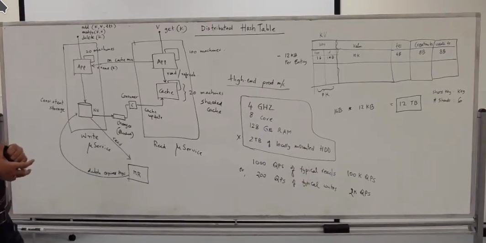
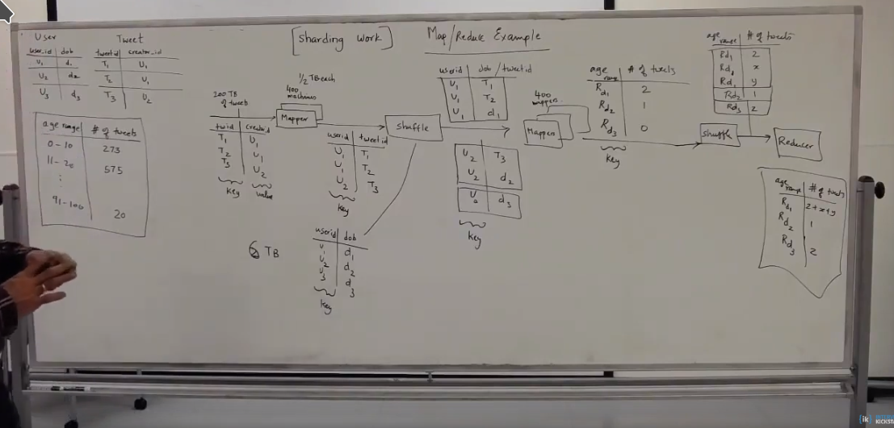
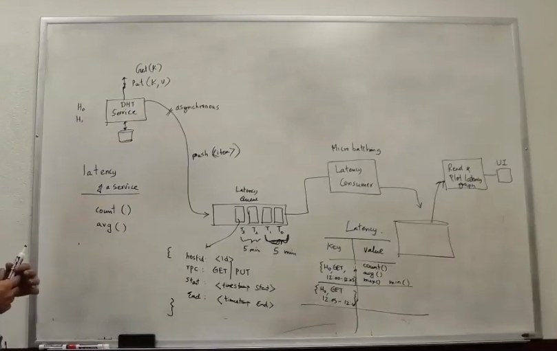
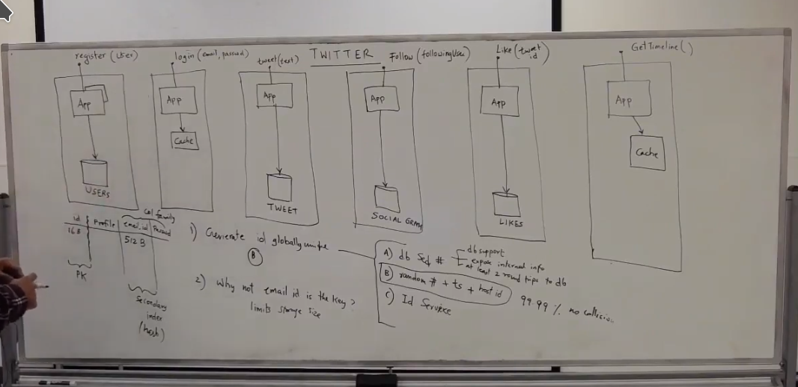
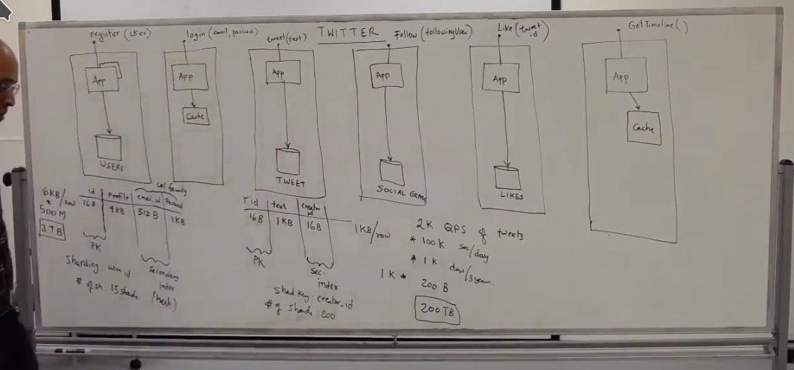
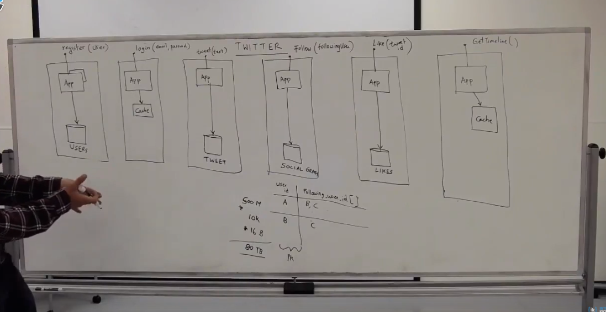
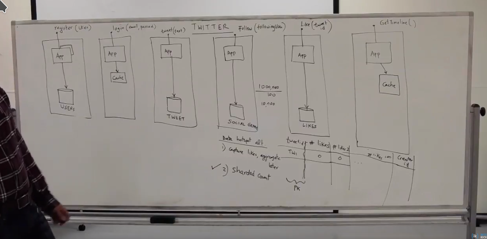
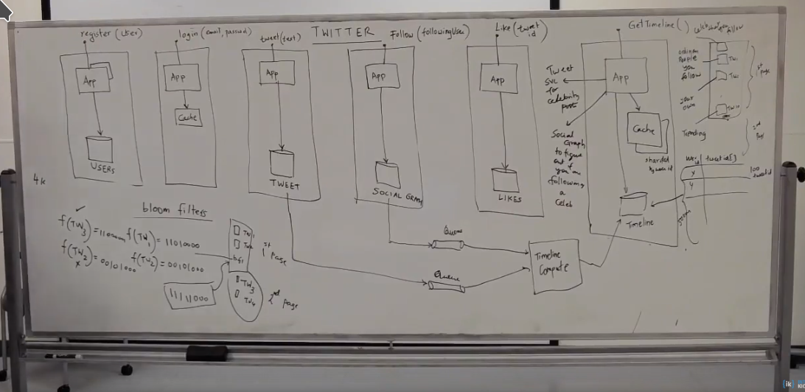
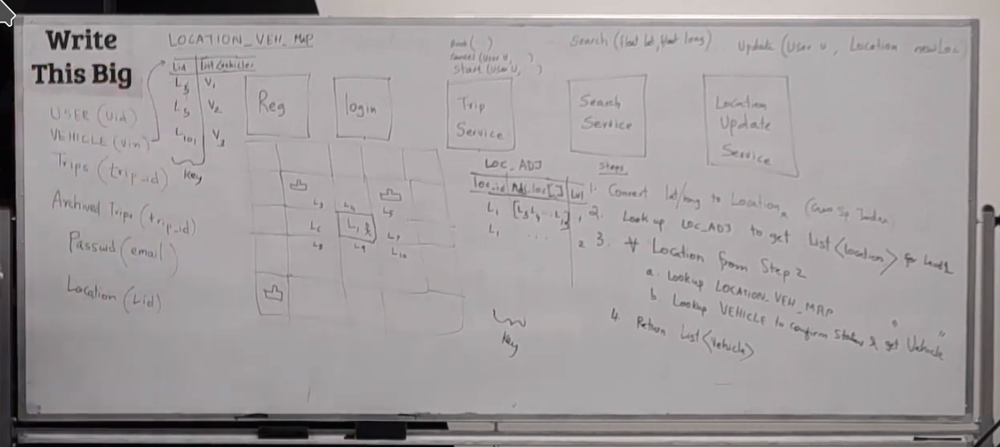

#Scalable Systems
Problems:
1. parallel
1. geo location
1. data size limitiation
1. single point of failure
1. server hotspot
1. data hotspot

### Building blocks

app servers w/load balancers; 1, 4, 5

data replication; 1, 2, 4

data Sharding(partitioning by row); 1, 3, 6
> can partition by row, col, or any way data can be partitioned

caching; 1,2,6

###Micro services
App->cache->storage

### Storage
1. logical schemas;
    1. relational
        * tables and columns
    1. key value pair
        * documents
        * json/xml
    1. graph model
        * social graph

1. physical schemas
    1. row major format
        * rows stored consecutively by bit offset
        * hard to search to for specific column; avg/min/max of column
    1. column major format  
        * group by purpose; security column family
        * val, name stored in rows, by bit offset; 001|name|passwd|002|name|passwd
        * good for column analysis; avg/min/max of column
        * good for massive parallel processing (MPP)
        
1. indexing
    * hashed key
        1. stored on disk with offset
    * b-tree index
        * not exact
        * range based retrieval
    * combo of the two
    
     
###sharding
goals;
1. distributed by rows
1. near even distribution
1. add new shards
1. shards always available

simplistic
1. fixed; n shards
1. userId % n
    * expensive to add shards
    * shards become unavailable

consistent hashing
1. c-n-1 && 0-a = s1; add shards to between c and a
    a-b = s2
    b-c = s3

server | replicated
-------|-----------
a-b->s2|a-b->s3
b-c->s2|b-c->s4
c-d->s4|d-a->s2

###replication
1. DB receives write req
1. write 'pending' to change log
1. write to DB
1. write 'complete' to change log
    * 'completed' change logs are replicated

###consistency availability
consistent
1. quorum reads/writes
1. get latest change
1. availability not guaranteed

availability
1. consistency not guaranteed
1. less failure
1. stale reads
    
ACID
1. atomic
1. consistant
1. integrity
1. durability

   
cap 
1. consistent-availability-partitions
1. any 2 of 3, never all 3

###caching
1. what is stored
1. size
1. type of cache
    * write through
    * write around
    * write later
1. physical topology
    * sharded
    * copies
        1. dedicated
        1. in app service
    
write through; app->cache->db
    * not for cross schema
    * 
    
write around; app->db->cache(possibly shared)
1. app reads from cache
1. writes directly to db
1. cache miss updates cache async
    * cache may be shared with other services
1. good for shared cache

write later; 
1. write/read to cache
1. writes get save to storage later async

###db comparisons
__nosql__; large data, flexible schema, high throughput

__rdbms__; transactionality, data joins, security, integrity

capability|rdbms|nosql
----------|-----|------
logical schema | relational| key/value
- | -| document                                                         
- | -| object sotre                                                         
- | -| graph                                                     
- | -| column family
physical schema instance|row major|column major
schema flexibility| rigid|elastic
security| native | none; left to upper layers                                  
data integrity| native| none; app layer
indexing| hash, b-tree| hash, b-tree, hybrid
sharding/replication| limited, layered, expensive| native
large data| < 1tb good, > 1 tb degradation | native
transactionality| native, acid| none
locking| row level, dead lock, detection| cell level, leasing
interface| sql| api, sql
data joins| native| none - upper layers
throughput r/w| good low volumes; great for high| excellent

###distributed hash table
requirements

functional| capacity
----------|----------
stores key value pairs| 1 billion kvp entries
unique keys|  2k qps of writes
keys are primitive types; int, string| 100k qps of reads
values complex objects|  value size 10 KB
get/put/delete based on single key|
ttl on each entry|
    
    
###Microservice
>CRUD, MR (map reduce), TTL (time to live), QPS (queries per second)

write service
CUD -> app -> storage (kv)

    1. updates read cache
    1. wired up to MR
    
read service
R -> app -> cache

MR

    1. implements TTL
    1. delete expired keys
    
__storage__

Primary key| value| ttl| crated ts| updated ts
-----------|------|----|----------|---------
type, value | 10k | 4B | 8B |
int, id | -| -| -|
1b, 1kb | -| -| -|

scalable system design

###map reduce

###micro batching

###Twitter architecture
login/register

tweets

following

likes

timeline - bloom filters

#class

Rideshare

locations; l1, l2, etc.  1 mile square grid
l1: {a:lat, long, c:lat, long}

Search service

Service deep dive  
* model: k-v pair
* cache: hashmap
* storage: rowstore
* api
    * create
    * udpate    
* flow
    * app server consumes vehicle registration/location
    * sends cache to server tier
    * writes back to caching
