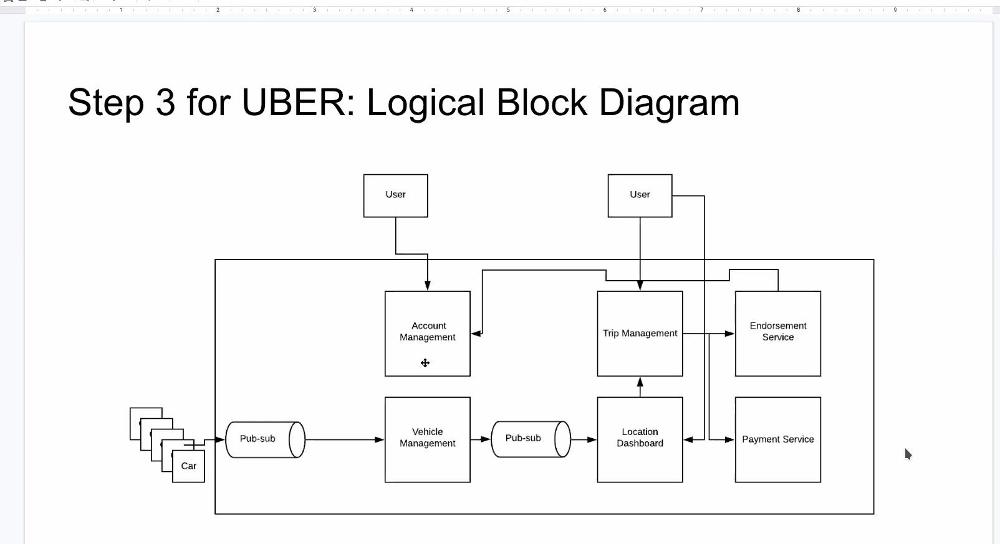
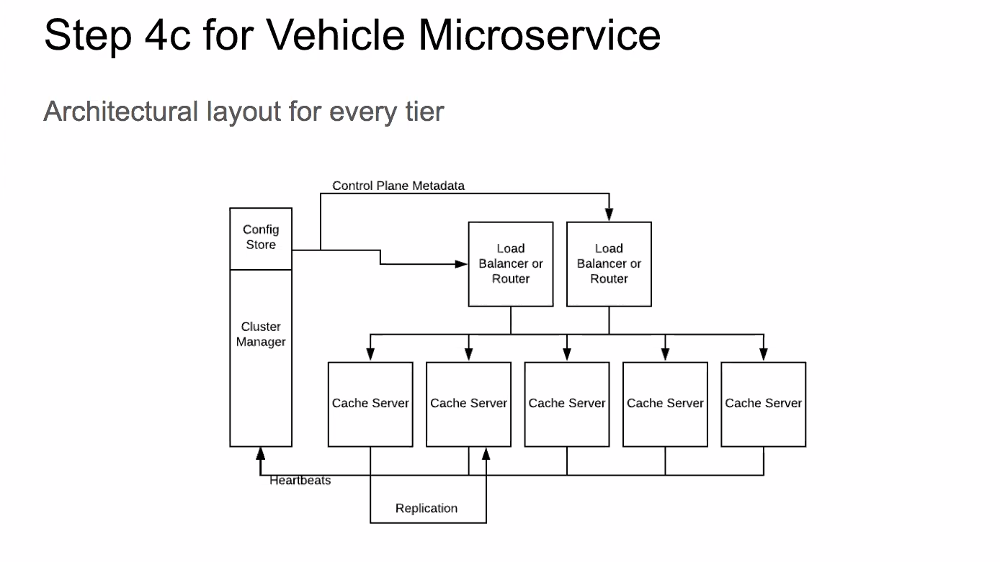

#class
designing a scalable system outline
>do not specify any particular technology

typical iops: 30-80k

####steps:
1. collect requirements
    * functional; problem statement
    * design constraints; numbers
1. bucket functional reqs into microservices
1. draw logical architecture
1. deep dive each service
    * identify data model
    * how it will be stored and cached
    * propose API
    * propose workflows/algo for api in each tier
    * propose flow across tiers        
        1. do services need to scale: 
            * storage
            * cache
            * cpu/io
            * hotspots
        1. solve algebra first, the put numbers
            * data record size
            * throughput
        1. draw architecture
            * partition into shards
            * algo to populate shards; consistent hashing
            * explain how APIs work in this sharding scenario
            * propose CP or AP (CAP)

####uber
__step 1__ - collect reqs:
1. account mgmt;users,drivers
1. location based dashboard
1. rider functionality
    * order ride
    * give options
    * get cost eta
    * pay/tip
    * rate driver
    * trip progress
1. driver functionality
    * accept/reject ride
    * rate rider

__step 2__ - microservices
1. account mgmt (riders/drivers) service
1. vehicle mgmt  service
1. location based dashboard service
1. payment mgmt service
1. endorsement mgmt service

__step 3__ uber diagram

__step 4c__

